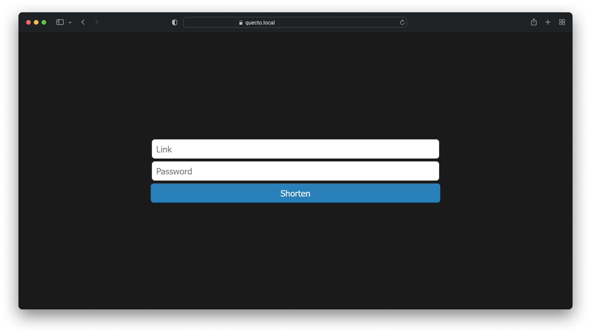
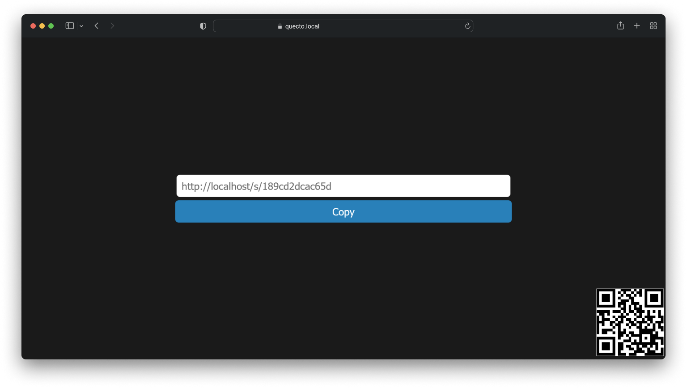
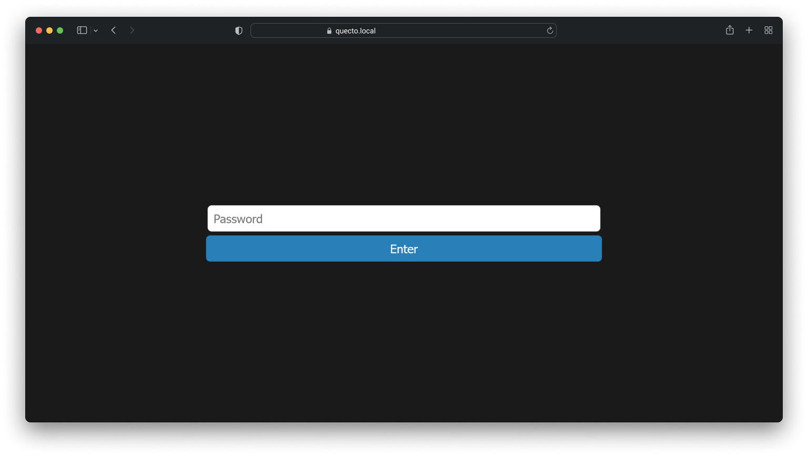

# Quecto
Quecto is a universal, open-source solution that lets you create your own link shortening system.
- An open and self-hostable solution
- Customizable
- Utilisable dès maintenant, hébergé sur [Quecto](https://s.oriondev.fr).





## Installation

### Node JS

#### Prerequisites
- Node JS 14.0.0 or higher
- NPM 6.0.0 or higher
- MongoDB 4.0.0 or higher (if you use MongoDB)

#### Installation
1. Clone the repository
```bash
git clone https://github.com/oriionn/quecto.git
```
2. Install dependencies
```bash
npm install
```
3. Configure the file `config.js`
```js
module.exports = {
  // The port of the website
  PORT: 80,

  // The domain name of the website
  DOMAIN: "http://localhost",

  // Database type: json, mongodb
  DB_TYPE: "json",

  // mongodb config (if DB_TYPE is mongodb)
  DB_HOST: "127.0.0.1",
  DB_PORT: 27017,
  DB_NAME: "quecto",
  DB_USER: "",
  DB_PASS: "",

  // json config (if DB_TYPE is json)
  DB_JSON_PATH: "./db.json"
}
```

4. Start the server
```bash
npm start
```

### Docker
#### Docker Run
If you use JSON:
```bash
docker run -d \
  -p [PORT]:3000 \
  -e DOMAIN=http://localhost \
  -e DB_TYPE=json \
  -e DB_JSON_PATH=./db.json \
  --name quecto \
  oriionn/quecto
```
If you use MongoDB:
If you don't use username and password:
```bash
docker run -d \
  -p [PORT]:3000 \
  -e DOMAIN=http://localhost \
  -e DB_TYPE=mongodb \
  -e DB_HOST=127.0.0.1 \
  -e DB_PORT=27017 \
  -e DB_NAME=quecto \
  oriionn/quecto
```
If you use username and password:
```bash
docker run -d \
  -p [PORT]:3000 \
  -e DOMAIN=http://localhost \
  -e DB_TYPE=mongodb \
  -e DB_HOST=127.0.0.1 \
  -e DB_PORT=27017 \
  -e DB_NAME=quecto \
  -e DB_USER=username \
  -e DB_PASS=password \
  oriionn/quecto
```
**⚠ Don't edit :3000**

#### Docker Compose
If you use JSON:
```yaml
version: "3.8"
services:
  quecto:
    image: oriionn/quecto
    container_name: quecto
    ports:
      - "[PORT]:3000"
    environment:
      - DOMAIN=http://localhost
      - DB_TYPE=json
      - DB_JSON_PATH=./db.json
```
If you use MongoDB:
If you don't use username and password:
```yaml
version: "3.8"
services:
  quecto:
    image: oriionn/quecto
    container_name: quecto
    ports:
      - "[PORT]:3000"
    environment:
      - DOMAIN=http://localhost
      - DB_TYPE=mongodb
      - DB_HOST=127.0.0.1
      - DB_PORT=27017
      - DB_NAME=quecto
```
If you use username and password:
```yaml
version: "3.8"
services:
  quecto:
    image: oriionn/quecto
    container_name: quecto
    ports:
      - "[PORT]:3000"
    environment:
      - DOMAIN=http://localhost
      - DB_TYPE=mongodb
      - DB_HOST=127.0.0.1
      - DB_PORT=27017
      - DB_NAME=quecto
      - DB_USER=username 
      - DB_PASS=password
```
**⚠ Don't edit :3000**

## API
### Create a short link
```http
POST /api/shorten
```
#### Parameters
| Name       | Type | Description                             |
|------------| --- |-----------------------------------------|
| `link`     | `string` | **Required**. The URL to shorten.       |
| `password` | `string` | **Optional**. The password of the link. |

#### Response
```json
{
  "status": 200,
  "data": {
    "original": "https://google.com",
    "shorten": "http://quecto.local/abc123"
  }
}
```
(The type of the body is `multipart/form-data`)

(Precise the domain name in the `config.js` file)

### Get a short link
```http
GET /api/s/:code
```

#### Query
| Name       | Type | Description                             |
|------------| --- |-----------------------------------------|
| `password` | `string` | **Optional**. The password of the link. |

#### Response
```json
{
  "status": 200,
  "data": {
    "original": "https://google.com",
    "shorten": "http://quecto.local/abc123"
  }
}
```

### Know if this instance is a quecto instance
```http
GET /api/quectoCheck
```

#### Response
```json
{
  "status": 200,
  "data": {
    "quecto": true
  }
}
```

## Contributing
Pull requests are welcome. For major changes, please open an issue first to discuss what you would like to change.


## License
[GPL3](https://github.com/oriionn/quecto/blob/main/LICENSE)
